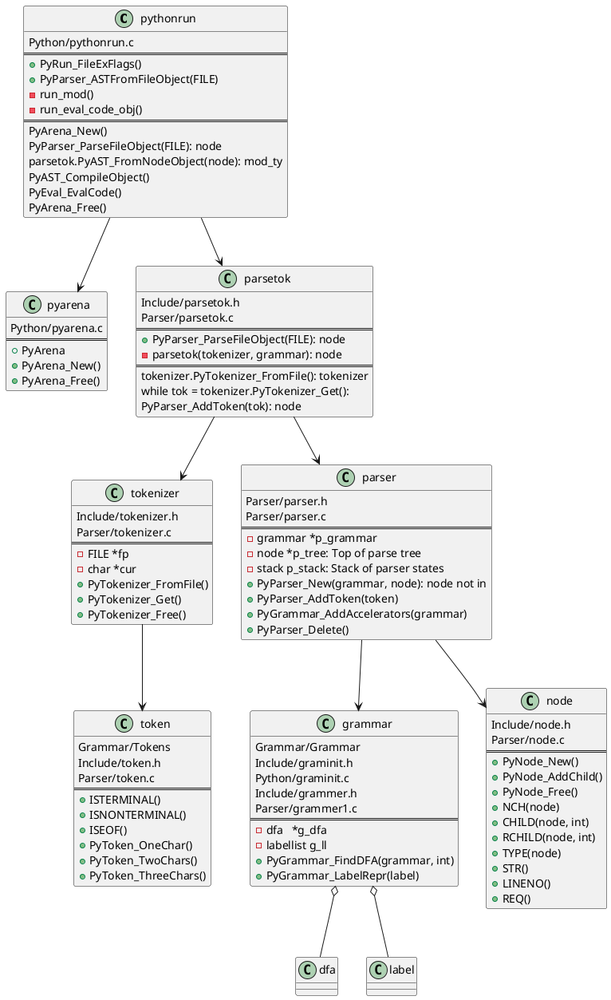

# Python Grammar

<https://cpython-devguide.readthedocs.io/grammar/#>

[Modifying the Python language in 6 minutes](<https://hackernoon.com/modifying-the-python-language-in-7-minutes-b94b0a99ce14>)

CPython works in four steps:

- lexing
- parsing
- compiling
- interpreting

## Python Parser Generator

`Python/pgen`: Python’s parser generator

- `make regen-grammar`
- `make regen-token`
-  `make regen-ast`

### Token

Definition: `Grammar/Tokens`

Run `make regen-token`, generates:

- `Include/token.h`
- `Parser/token.c`
- `Lib/token.py`
- `Doc/library/token-list.inc`

Lexer:

- `Parser/tokenizer.c`: The CPython lexer
- `Lib/tokenize.py`: a lexical scanner for Python source code

### Grammar

Definition: `Grammar/Grammar`

Run `make regen-grammar`, generates:

- `Include/graminit.h`
- `Python/graminit.c`

`Modules/parsermodule.c`: give a parse tree produced by Python code as a tuple to the compiler

### Parse Trees

`Include/node.h`

`Parser/node.c`

`Parser/parser.c`

`Parser/parsetok.c`: Parser-tokenizer link implementation

### AST

Definition: `Parser/Python.asdl`

Run `make regen-ast`, generates:

- `Include/Python-ast.h`
- `Python/Python-ast.c`

`Python/ast.c`: transform a concrete syntax tree (CST) to an abstract syntax tree (AST)

`Lib/ast.py`

## UML

注: VS Code中安装下PlantUML可查看生成的UML图。

